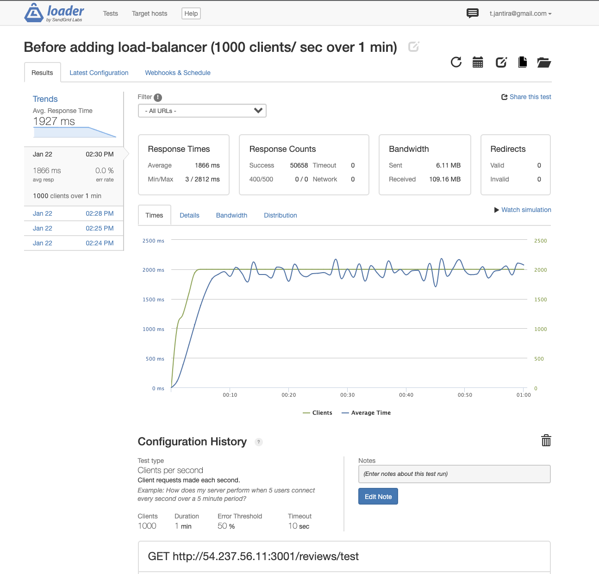
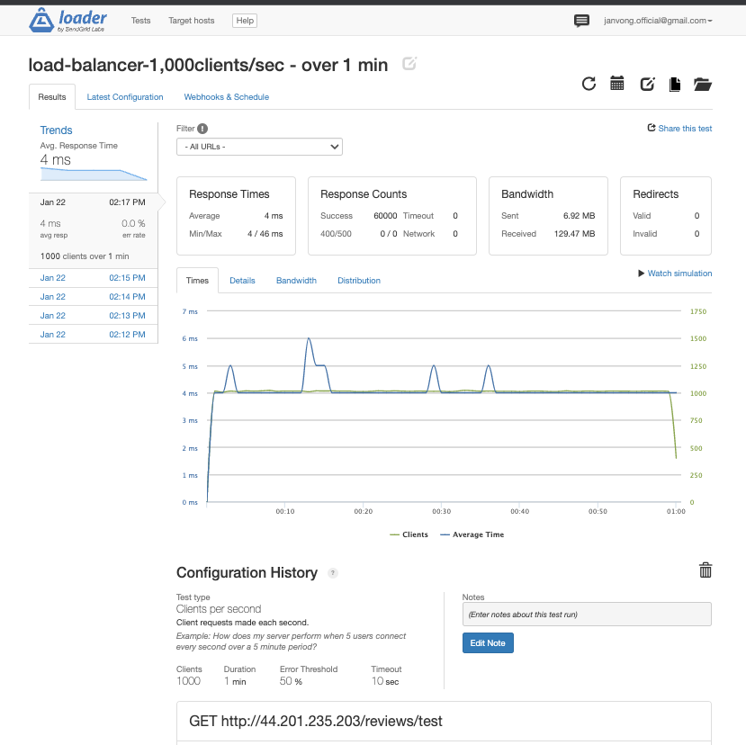

# Reviews-API #


## This is an API backend for Product Reviews on Shopping E-commerce Application ##

## Get Start
- git clone [https://github.com/Peaceful-Pistachio/Reviews-API.git]
- npm install
- to start server run command "npm start"

EndPoint [ http://localhost:3001 ] Local version
EndPoint [ http://44.201.235.203 ] Deploy server version

## Features
- User can see all reviews of current product if there is a review for that product
- User can see summary of reviews on each product such as overall rating, recommended and average rating on each  characteristic of the product which is vary by product
- User can interact on each review by voting a review as helpful or reporting a review
- User can post new review on each product

## API Documentation

## **Get** [  /reviews  ]

### query params
 - product_id type of Number (required)
 - page type of Number (optional), by default page is 1
 - count type of Number (optional), by default count is 5
 - sort type of String (optional), sort selection is 'helpful', 'newest' and 'relevant', by default sort is 'relevant'

 ### Sample request 
*[ http://localhost:3001/reviews?product_id=32 ]*
 ### Sample result with *response 200 status*
```json  
 {
    "product_id": 32,
    "page": 1,
    "count": 5,
    "results": [
        {
            "id": 136,
            "rating": 1,
            "date": "1970-01-01T00:00:00.000Z",
            "summary": "Sint inventore at excepturi ut sit sit ea aliquam repudiandae.",
            "body": "Dicta impedit autem tempora a sapiente. Mollitia nulla veritatis blanditiis voluptas. Vel perferendis aut sunt dolorem sed et.",
            "recommend": false,
            "reported": false,
            "reviewer_name": "Maiya_Carroll8",
            "response": "null",
            "helpfulness": 7,
            "photos": []
        },
        {
            "id": 138,
            "rating": 3,
            "date": "1970-01-01T00:00:00.000Z",
            "summary": "Ipsum repellendus alias earum et est autem molestiae quis quia.",
            "body": "Natus est quaerat voluptate possimus nihil tenetur et et ea. Necessitatibus voluptas iste. Quibusdam consequatur velit dolores asperiores amet.",
            "recommend": true,
            "reported": false,
            "reviewer_name": "Jedidiah.DAmore31",
            "response": "null",
            "helpfulness": 11,
            "photos": []
        }
    ]
}
```

## **Get** *[ /reviews/meta ]*

## query params
 - product_id type of Number (required)

### sample request *[ http://localhost:3001/reviews/meta?product_id=32 ]*
### sample result with *response 200 status*
```
 {
    "product_id": 32,
    "rating": {
        "1": 1,
        "3": 2
    },
    "recommended": {
        "false": 1,
        "true": 2
    },
    "characteristics": {
        "Fit": {
            "id": 116,
            "value": "4.33"
        },
        "Length": {
            "id": 117,
            "value": "2.00"
        },
        "Comfort": {
            "id": 118,
            "value": "2.67"
        },
        "Quality": {
            "id": 119,
            "value": "3.33"
        }
    }
}
```

## **Post** [ /reviews ] response *status 201 created*

## query params
 - product_id type of Number (required)
 - rating type of object (required)
 - summary type of Srting, less than 20 characters (optional)
 - body type of String, less than 1,000 characters (required)
 - recommend type of Number in range of 1 to 5 (required)
 - name and email type of String, less than 60 characters (required)
 - photo type of array (optional)
 - characteristics type of object (required)

### sample Post request header

```json  
{
    "product_id":32,
    "rating": 5,
    "summary":"great",
    "body":"not bad",
    "recommend": true,
    "name":"sampleName",
    "email": "sample@gmail.com",
    "photos":["https://encrypted-tbn0.gstatic.com/images?q=tbn:ANd9GcS4NyOkOP5kTwy057xuDDPPc0loHhSCm2XJMSOtXuXEwpuiAgVv2w-VD73mImPDdUzN13g&usqp=CAU"],
    "characteristics": {
        "6": 4,
        "7":4,
        "8":4,
        "9":5
    }
}
```


## **Put request** *[ /reviews/review_id ]* response *status 204 no content*

### Sample Put request for vote review as helpful [ /reviews/review_id/helpful ]
### Sample Put request for report review [ /reviews/review_id/report ]


## Test Metric for Deploy Version on AWS after optimization
**optimization** 


## Speed up RPS from 2s to 0.004s 




